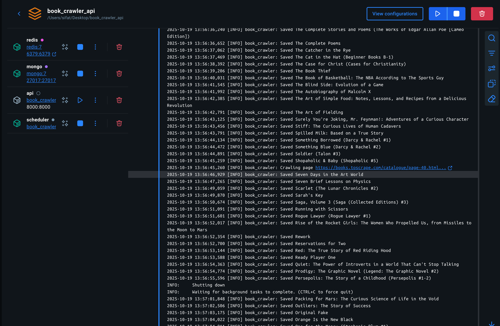
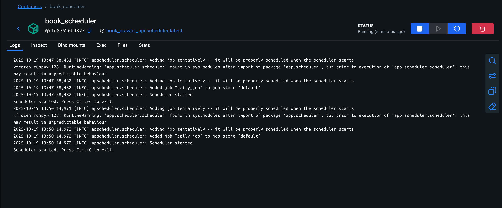

# Book Crawler API

A **production-grade**, scalable web crawling and monitoring system for [books.toscrape.com](https://books.toscrape.com) built with **FastAPI**, **MongoDB**, **Redis**, and **APScheduler**.

---

## Features

- **Async Web Crawler** using `aiohttp` and `selectolax`
- **MongoDB Storage** with deduplication and change tracking
- **Scheduled Change Detection** via APScheduler
- **RESTful API** with OpenAPI documentation
- **User Authentication** with API key-based access control
- **Rate Limiting** using Redis-backed `slowapi`
- **Admin/Main User** system for user management
- **Comprehensive Test Suite** with `pytest-asyncio`
---


### User Roles & Access Control

The system supports two types of API key–based users with distinct permissions:

#### Admin User
- Has a predefined API key configured in .env (ADMIN_API_KEY).
- Can create, update, and delete users.
- Has full access to all endpoints including user management routes.
- Can also access and perform all general book, change, and report operations.

#### Regular User
- Created only by an admin API key–based user.
- Can access book listings, book details, change tracking, report generation, and trigger crawling.
- Cannot create, update, or delete users.
- Access is controlled via their unique API key generated during user creation.

This ensures secure API-level role separation, where administrative tasks remain strictly under admin control, while general users can only view or trigger non-destructive operations.


## Tech Stack

| Component                 | Technology             | Purpose                         |
|---------------------------|------------------------|---------------------------------|
| **Web Framework**         | FastAPI                | High-performance async REST API |
| **Database**              | MongoDB (Motor)        | NoSQL storage with async driver |
| **Cache & Rate Limiting** | Redis                  | Token bucket rate limiting      |
| **HTML Parsing**          | Selectolax             | Fast, memory-efficient parsing  |
| **HTTP Client**           | aiohttp                | Async web crawling              |
| **Scheduler**             | APScheduler            | Daily change detection jobs     |
| **Validation**            | Pydantic               | Data schema validation          |
| **Testing**               | pytest, pytest-asyncio | Async unit/integration tests    |

---

## Project Structure

```
book_crawler_api/
├── app/
│   ├── api/                    # FastAPI routes
│   │   ├── __init__.py
│   │   ├── book_router.py      # GET /books, /books/{id}
│   │   ├── change_router.py    # GET /changes, /changes/{id}
│   │   └── user_router.py      # POST /users (admin only)
│   ├── crawler/
│   │   ├── __init__.py
│   │   ├── crawler.py          # BookCrawler class
│   │   └── parser.py           # HTML parsing logic
│   ├── db/
│   │   ├── __init__.py
│   │   ├── repository
│   │   │   ├── __init__.py
│   │   │   ├── book_repository.py
│   │   │   ├── cache.py
│   │   │   ├── change_book_repo.py
│   │   │   └── user_repository.py
│   │   └── database.py          # MongoDB connection
│   ├── scheduler/
│   │   ├── __init__.py
│   │   ├── scheduler.py        # APScheduler setup
│   │   └── detector.py         # Change detection logic
│   ├── schemas/                # Pydantic models
│   │   ├── __init__.py 
│   │   ├── book_schemas.py
│   │   └── user_schemas.py 
│   ├── services/           
│   │   ├── __init__.py 
│   │   ├── book_service.py
│   │   ├── change_book_service.py
│   │   └── user_service.py 
│   ├── utils/
│   │   ├── __init__.py
│   │   ├── security.py         
│   │   ├── enums.py
│   │   ├── logger.py                
│   │   └── pagination.py  
│   ├── tests/                
│   │   ├── __init__.py 
│   │   ├── test_book_api.py
│   │   ├── test_change_book_api.py
│   │   ├── test_scheduler.py
│   │   └── test_crawler.py 
│   ├── __init__.py
│   └── main.py                 # FastAPI app entry point
├── .env                        # Environment variables (DO NOT COMMIT)
├── .env.example                # Template for .env
├── docker-compose.yml          # MongoDB + Redis services
├── Dockerfile                  # App containerization
├── requirements.txt            # Python dependencies
└── README.md

````

---

## Prerequisites

- **Python**: 3.10+ (tested on 3.13.5)
- **Docker & Docker Compose**: For MongoDB and Redis
- **Git**: For cloning the repository

---


## Deployment(Easy way to run)

### Docker Compose (Full Stack) 

Edit `.env` with your settings for containerization:
```
MONGO_URL=mongodb://mongo:27017
DB_NAME=bookstore
BASE_URL=https://books.toscrape.com
ADMIN_API_KEY=supersecretkey123
REDIS_URL=redis://redis:6379
HOST=http://localhost:8000
```
Must download docker and docker compose before run the below commands.

```
docker compose build
docker compose up
```

Then started the server on port 8000.
https://localhost:8000/docs

## Installation & Setup (Manual Setup for run)

### 1. Clone the Repository

```
git clone https://github.com/GenesisBlock3301/book_crawler_api.git
cd book_crawler_api
````

### 2. Create Virtual Environment

```
python3 -m venv .venv
source .venv/bin/activate  # Windows: .venv\Scripts\activate
```

### 3. Install Dependencies

```
pip install --upgrade pip
pip install -r requirements.txt
```

Edit `.env` with your settings:

```
MONGO_URL=mongodb://localhost:27017
DB_NAME=bookstore
BASE_URL=https://books.toscrape.com
ADMIN_API_KEY=supersecretkey123
REDIS_URL=redis://localhost:6379
HOST=http://localhost:8000
```

Note: run the above command from the root folder of a project.

---

## Running the Application

**Always run commands from the project root** (`book_crawler_api/`).

### 1. Run the Crawler (Initial Setup)

```
python -m app.crawler.crawler
```

This will:

* Crawl all books from `books.toscrape.com`
* Store data in MongoDB (`books` collection)
* Save raw HTML snapshots

### 2. Start the FastAPI Server

```
uvicorn app.main:app --reload --host 0.0.0.0 --port 8000
```

Or via Python module:

```
python -m app.main
```

API docs:

* **Swagger UI**: [http://localhost:8000/docs](http://localhost:8000/docs)
* **ReDoc**: [http://localhost:8000/redoc](http://localhost:8000/redoc)

### Run the Scheduler (Change Detection)

```
python -m app.scheduler.scheduler
```

This runs daily at midnight to:

* Detect new books
* Track price/availability changes
* Log changes to `book_changes` collection

---

## API Documentation
### Crawl Endpoints
#### Crawling all books

```
GET /api/crawler/
```
If the crawler fails on a certain page, you can restart it from the last saved page using this endpoint to continue
crawling all remaining books.

Note: This endpoint runs in background.

### User Endpoints
#### Admin: Create Users

The first admin user is auto-created from `.env`.
**Create a new user**:

```
POST /api/users/create
```
**Get all users**:
```aiignore
GET /api/users/
```
**Get Username By Username**
```aiignore
GET /api/users/{username}
```
**Update User**
```aiignore
PUT /api/users/{username}
```
**Delete User**
```aiignore
DELELE /api/users/{username}
```
---

### Book Endpoints

**Get All Books**

```
GET /api/books
```

**Query Parameters:**

| Parameter   | Type   | Description            | Example                      |
|-------------|--------|------------------------|------------------------------|
| `category`  | string | Filter by category     | `Travel`                     |
| `min_price` | float  | Minimum price          | `20.0`                       |
| `max_price` | float  | Maximum price          | `50.0`                       |
| `rating`    | int    | Filter by rating (1-5) | `4`                          |
| `sort_by`   | string | Sort field             | `price`, `rating`, `reviews` |
| `page`      | int    | Page number            | `1`                          |
| `limit`     | int    | Items per page         | `20`                         |


**Get Single Book by ID**

```
GET /api/books/{book_id}
```

### Change Tracking Endpoints

**Get All Changes**

```
GET /api/changes
```
**Get Change by ID**
```
GET /api/changes/{change_id}
```
### Generate report
```
GET /api/report/
```
---

### 

### Rate Limiting

* **Default**: 100 requests per hour per API key
* **Exceeding Limit Response**:

```json
{
  "detail": "Too Many Requests"
}
```
Status Code: `429 TOO MANY REQUESTS`

---

## Testing

Run all tests:

```
pytest
```

Run specific test files:

```
pytest app/tests/test_crawler.py -v
pytest app/tests/test_book_api.py -v
pytest app/tests/test_change_book_api.py -v
pytest app/tests/test_schedular.py -v
```

---

Services started:

* MongoDB
* Redis
* FastAPI (port 8000)
* Scheduler

## Screenshots 

### Crawling



### Scheduler

